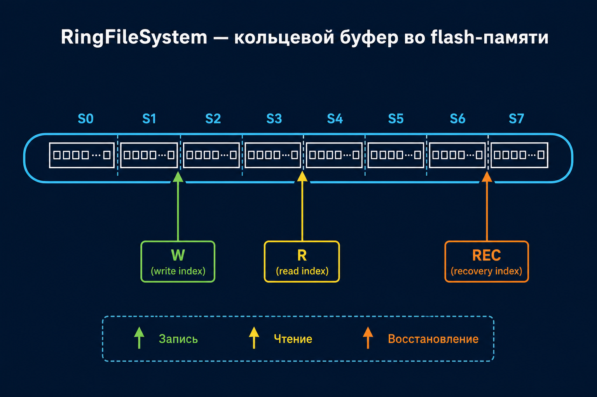
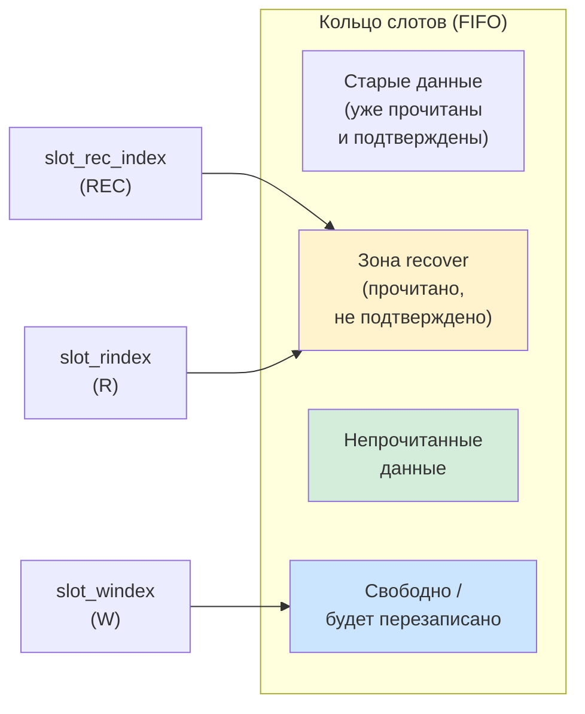
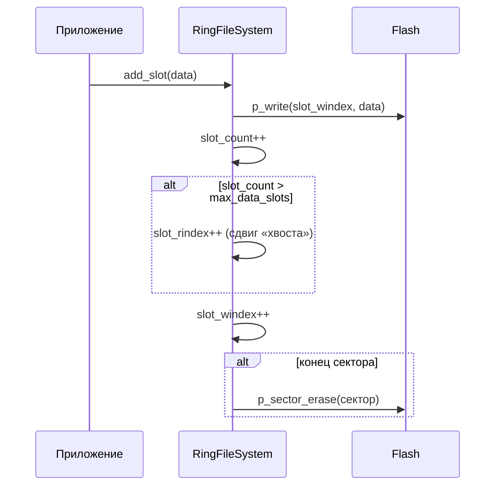
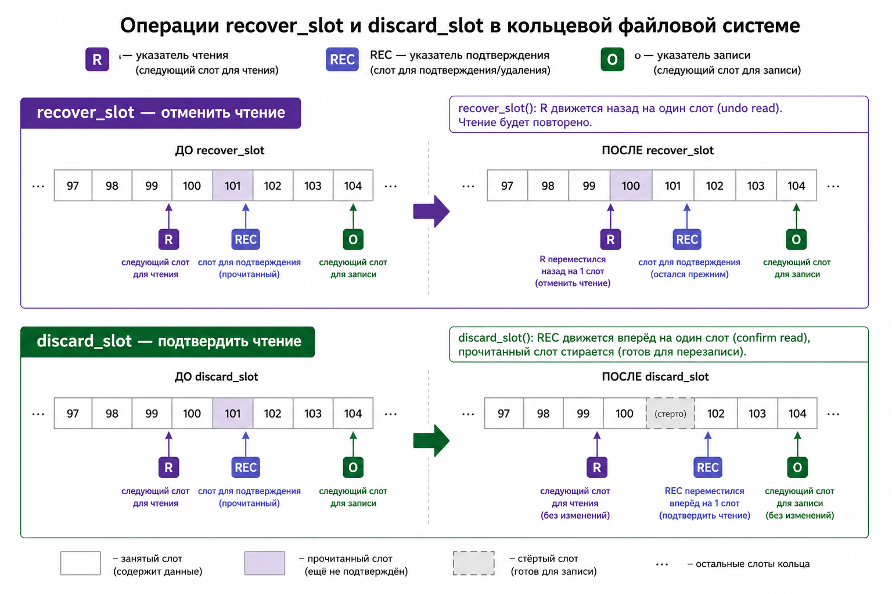
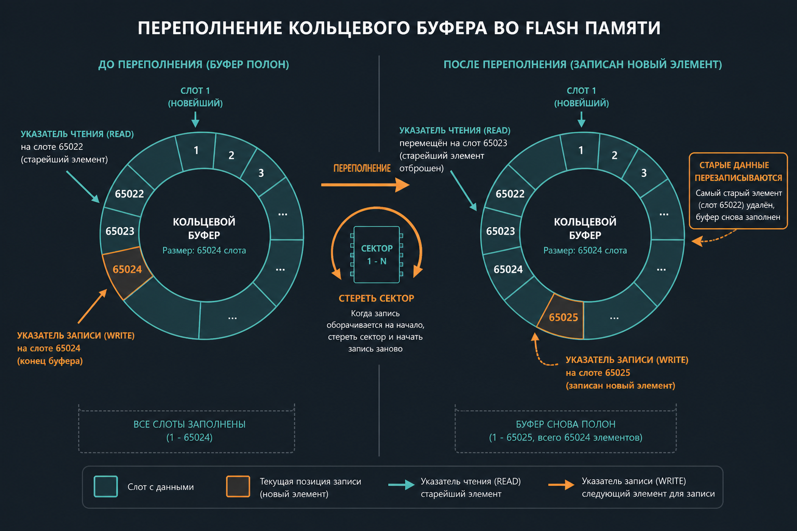
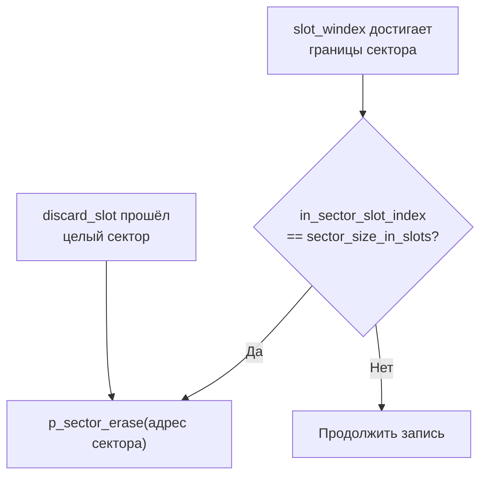
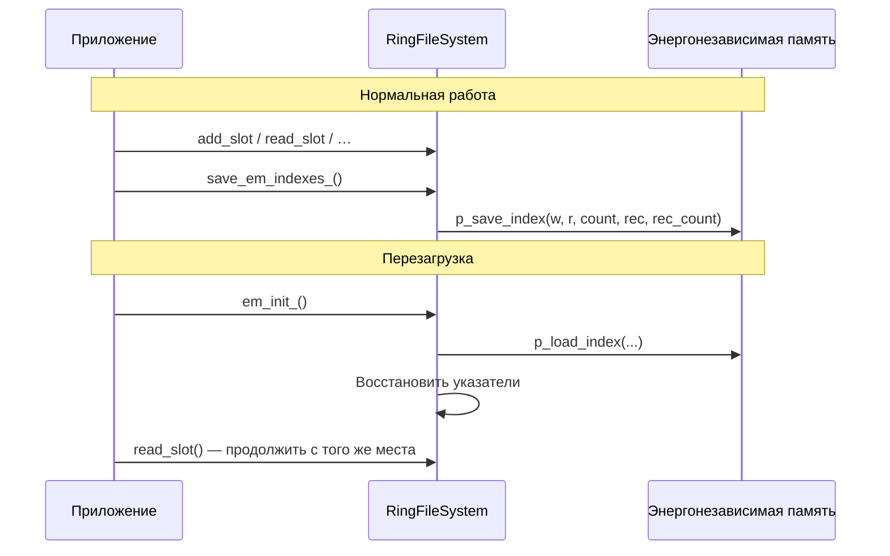
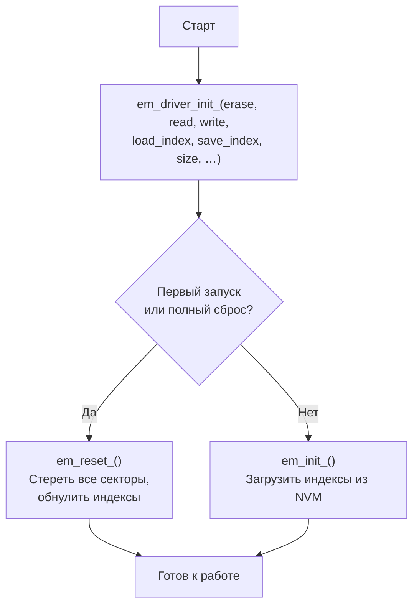
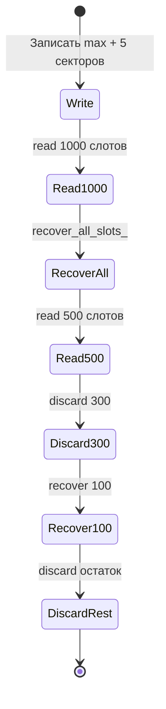

# RingFileSystem — иллюстрированное описание

Кольцевая файловая система для внешней flash-памяти (NOR/NAND). Данные хранятся в **слотах** фиксированного размера; при заполнении буфера старые записи автоматически перезаписываются. Поддерживаются отмена чтения (`recover`) и подтверждение удаления (`discard`) — удобно для встраиваемых систем с журналированием телеметрии.

---

## 1. Зачем это нужно

```
┌─────────────────────────────────────────────────────────────┐
│  Микроконтроллер                                            │
│  ┌──────────────┐    add_slot()    ┌─────────────────────┐  │
│  │  Приложение  │ ───────────────► │  RingFileSystem     │  │
│  │  (GPS, CAN…) │ ◄─────────────── │  (кольцевой буфер)  │  │
│  └──────────────┘   read_slot()    └──────────┬──────────┘  │
│                                               │              │
│                                    p_read / p_write / erase  │
│                                               ▼              │
│                                    ┌─────────────────────┐    │
│                                    │  Flash / EEPROM     │    │
│                                    │  (внешняя память)   │    │
│                                    └─────────────────────┘    │
└─────────────────────────────────────────────────────────────┘
```

**Типичные сценарии:**
- журнал координат GPS (слот = timestamp + lon + lat);
- накопление дистанции/одометра (слот = timestamp + distance);
- любой поток однородных записей, где важнее «последние N» записей, чем полная история.

---

## 2. Структура памяти

Память делится на **секторы** (стираемые блоки flash), каждый сектор — на **слоты** (единицы записи).

```
  Flash-память (пример: 512 КБ, сектор 4 КБ, слот 8 байт)
  ═══════════════════════════════════════════════════════════

  Сектор 0          Сектор 1          Сектор 2         …
  ┌────────────┐   ┌────────────┐   ┌────────────┐
  │ slot 0     │   │ slot 512   │   │ slot 1024  │
  │ slot 1     │   │ slot 513   │   │ slot 1025  │
  │ slot 2     │   │ slot 514   │   │ slot 1026  │
  │   …        │   │   …        │   │   …        │
  │ slot 511   │   │ slot 1023  │   │ slot 1535  │
  └────────────┘   └────────────┘   └────────────┘
       512 слотов      512 слотов       512 слотов

  Всего слотов:     em_size / slot_size        = 65 536
  Слотов в секторе: sector_size / slot_size    = 512
  Секторов:         em_size / sector_size      = 128
  Данных (макс.):   max_data_slots             = 65 024  (= max_slots − slots_per_sector)
```

> **Почему `max_data_slots` меньше `max_slots`?**  
> Один сектор резервируется как «зазор» при обходе кольца: когда указатель записи доходит до конца сектора, предыдущий сектор стирается. Это гарантирует, что всегда есть место для следующей записи без потери непрочитанных данных.

### Архитектура кольцевого буфера



| Указатель | Поле в коде | Назначение |
|-----------|-------------|------------|
| **W** (запись) | `slot_windex` | Куда будет записан следующий слот |
| **R** (чтение) | `slot_rindex` | Откуда читается следующий непрочитанный слот |
| **REC** (восстановление) | `slot_rec_index` | Граница между «прочитанными, но не подтверждёнными» и «ещё не читали» |

---

## 3. Три указателя — сердце системы



### Счётчики

| Поле | Описание |
|------|----------|
| `slot_count` | Сколько слотов доступно для чтения (между R и W) |
| `slot_rec_count` | Сколько слотов в зоне recover (между REC и R) |

**Инвариант:** `slot_rec_index` ≤ `slot_rindex` ≤ `slot_windex` (с учётом обхода кольца).

---

## 4. Операции — пошагово

### 4.1 `add_slot` — запись



```
  До записи:                    После add_slot:
  R ──► [A][B][C] ◄── W         R ──► [A][B][C][D] ◄── W
       3 непрочитанных                4 непрочитанных
```

### 4.2 `read_slot` — чтение (FIFO)

Читает **самый старый** непрочитанный слот. Указатель R сдвигается вперёд, `slot_count` уменьшается.

```
  read_slot() × 2:

  [A][B][C][D]          [C][D]
   ↑R  ↑REC              ↑R,↑REC
  читаем A, потом B → A и B в зоне recover
```

### 4.3 `recover_slot` — отмена последнего чтения

Сдвигает R **назад** на один слот. Данные в flash не трогаются — отменяется только логическое «прочитано».



```
  recover_slot():

  [C][D]  →  [B][C][D]
   ↑R         ↑R
  (B снова доступен для чтения)
```

- Возвращает новый `slot_count` или `-1`, если R == REC (нечего отменять).

### 4.4 `discard_slot` — подтверждение удаления

Сдвигает REC **вперёд**. Когда REC проходит целый сектор — сектор **стирается** (освобождается для перезаписи).

```
  discard_slot():

  [B][C][D]  →  [C][D]
   ↑R ↑REC       ↑R  ↑REC
  (B физически «забыт», сектор может быть стёрт)
```

### 4.5 Массовые операции

| Функция | Действие |
|---------|----------|
| `recover_all_slots_()` | Отменить все чтения: R → REC |
| `discard_all_slots_()` | Подтвердить все: REC → R, `slot_count = 0` |

---

## 5. Переполнение (overflow)

Когда записей больше, чем `max_data_slots`, буфер работает как **кольцо**: новые данные перезаписывают самые старые **непрочитанные** записи.



```
  max_data_slots = 65024

  Записано 65025 слотов:
  ┌────────────────────────────────────────┐
  │  [стёрто] [стёрто] … [65024][65025]    │
  │                         ↑R          ↑W │
  │  slot_count = 65024 (не больше макс.)  │
  │  Самый старый доступный = слот #2      │
  └────────────────────────────────────────┘
```

При переполнении:
1. `slot_rindex` автоматически сдвигается (старые данные «выпадают» из очереди);
2. `slot_rec_index` тоже сдвигается, если зона recover выходит за пределы;
3. При обходе сектора вызывается `p_sector_erase`.

---

## 6. Стерание секторов

Flash-память стирается **целыми секторами**, а не отдельными слотами.



```
  Сектор N стирается, когда:
  • запись (W) обошла полный круг и вернулась в начало сектора N+1, ИЛИ
  • discard (REC) подтвердил все слоты сектора N
```

---

## 7. Сохранение состояния при перезагрузке

Индексы хранятся **вне** RingFileSystem — через колбэки `p_load_index` / `p_save_index` (EEPROM, RTC backup, отдельный сектор flash).



Тесты `test_8_reboot` проверяют сохранение состояния во время overflow и между фазами read/recover/discard.

---

## 8. Инициализация



### Параметры (пример из тестов)

| Параметр | Значение (distance) | Значение (track) |
|----------|---------------------|------------------|
| `em_size` | 524 288 (512 КБ) | 65 536 (64 КБ) |
| `em_sector_size` | 4 096 | 4 096 |
| `em_slot_size` | 8 | 16 |
| `em_start_address` | 0x00000 | 0x80000 |

---

## 9. API — краткая шпаргалка

```c
// Инициализация
void *em = em_driver_init_(erase, read, write, load_index, save_index,
                           em_size, sector_size, slot_size, start_addr);
em_reset_(em);   // полный сброс
em_init_(em);    // загрузка индексов после reboot

// Запись и чтение
add_slot_(em, data);                    // записать слот
int32_t left = read_slot_(em, buf);     // прочитать FIFO; left = осталось или -1

// Управление прочитанным
recover_slot_(em);       // отменить последнее чтение
discard_slot_(em);       // подтвердить удаление прочитанного
recover_all_slots_(em);  // отменить все чтения
discard_all_slots_(em);  // подтвердить всё прочитанное

// Служебное
get_slot_count_(em);     // непрочитанных слотов
save_em_indexes_(em);    // сохранить индексы в NVM
```

---

## 10. Жизненный цикл — пример из тестов

Сценарий `test_7_lifecycle.five_overflow_read_recover_read_discard`:



```
  1. write_slots(65024 + 2560)     → slot_count = 65024
  2. read_slots(1000)              → slot_count = 64024
  3. recover_all_slots_()        → slot_count = 65024  (всё «непрочитано» снова)
  4. read_slots(500)               → slot_count = 64524
  5. discard × 300, recover × 100 → slot_count = 64622
  6. discard до конца              → recover больше невозможен
```

---

## 11. Ограничения и особенности

| Тема | Поведение |
|------|-----------|
| Размер слота | Фиксирован при инициализации |
| Порядок чтения | Строго FIFO (самый старый первым) |
| Переполнение | Старые **непрочитанные** теряются автоматически |
| Recover без read | Возвращает `-1` |
| Discard без read | Возвращает `-1` |
| Потокобезопасность | Не реализована — нужна внешняя синхронизация |
| Проверка CRC | Нет — целостность данных на совести приложения |

---

## 12. Сборка и тесты

```bash
cmake -DCMAKE_BUILD_TYPE=Release -S gtest -B gtest/build
cmake --build gtest/build
ctest --test-dir gtest/build -C Release --output-on-failure
```

Тестовые группы:

| Группа | Что проверяет |
|--------|---------------|
| `test_1` | Базовая запись/чтение, граничные размеры |
| `test_2_overwrite` | Массовое переполнение |
| `test_3_overwrite_buffer` | Запись поверх после частичного чтения |
| `test_5_recover_discard` | recover / discard / all |
| `test_6_overflow_*` | recover/discard при overflow |
| `test_7_lifecycle` | Комплексные сценарии |
| `test_8_reboot` | Сохранение индексов при перезагрузке |

---

## Автор

Roman Garanin — [RingFileSystem](https://github.com/Ethalon-emb/RingFileSystem)
